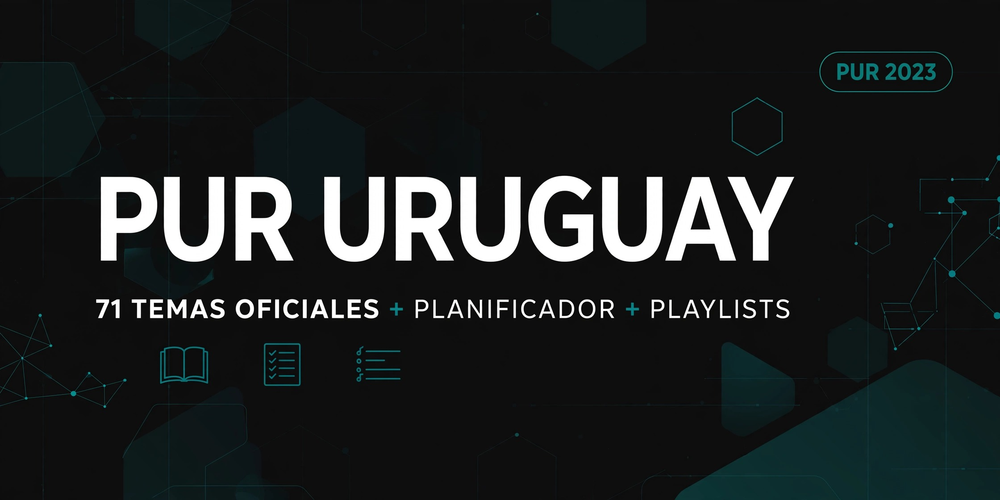

# PUR URUGUAY — 71 Temas + Planificador + Playlists


Plataforma gratuita, mobile-first y offline para la **Prueba Única de Residencia (PUR) Uruguay**. Incluye los 71 temas oficiales 2023, planificador con guardado de progreso en el celular y 12 playlists PUR-CIR de YouTube.

**Live:** https://temariopur.github.io/



---

## ✨ Features

- **71 temas oficiales PUR 2023** completos, buscables y filtrados por bloque
- **Planificador con progreso:** marca Pendiente / Repasar / Hecho → se guarda en `localStorage`
- **Export / Import de progreso** en `.json` para backup o cambio de celular
- **12 playlists PUR-CIR** organizadas: Medicina Interna, Familiar, Ginecología, Pediatría, Cirugía, Bioética, Psiquiatría, RCP Adulto y Pediátrico, Encares 2023-2026
- **PWA instalable:** funciona offline con Service Worker, íconos maskable, splash screen
- **Hecho para celular:** UI con Tailwind, animaciones suaves, vibración háptica al completar
- **SEO optimizado:** Open Graph 1200x630, JSON-LD `Course`, sitemap, robots.txt

## 🧩 Bloques

| Bloque | Temas |
| :--- | :--- |
| **PNA** | 1–10 |
| **Pediatría** | 11–20 |
| **Gineco-Obstetricia** | 21–34 |
| **Clínica Médica** | 35–48 |
| **Salud Mental** | 49–54 |
| **Legal** | 55–57 |
| **Bioética** | 58–60 |
| **Quirúrgica** | 61–71 |

## 🎵 Playlists

Medicina Interna, Medicina Familiar, Ginecología, Pediatría, Cirugía General, Bioética, Psiquiatría, RCP Adulto, RCP Pediátrico, Encares PUR 2023, 2024, 2025-2026. Todas linkeadas a YouTube (no cacheadas por SW).

## 🛠 Stack

- HTML5 + Tailwind CSS (CDN)
- Vanilla JS (sin frameworks)
- `localStorage` para progreso
- Service Worker `sw.js` cache-first
- Web App Manifest `manifest.json`
- Google Analytics G-M4FWC8G6HL
- Fuentes: Inter + JetBrains Mono

## 🚀 Instalación local

```bash
# Clonar
git clone https://github.com/temariopur/temariopur.github.io.git
cd temariopur.github.io

# Servir (cualquier static server)
python -m http.server 8000
# o
npx serve .
```
Abrí http://localhost:8000

No hay build step. Es 100% estático para GitHub Pages.

## 📁 Estructura

```
/
├── index.html          # App completa (temario + planificador + playlists)
├── manifest.json       # PWA manifest
├── sw.js               # Service Worker offline
├── icon-192.png        # Icon any + maskable 192
├── icon-512.png        # Icon any + maskable 512
├── icon-180.png        # Apple touch icon
├── favicon.png         # Favicon 32x32
├── og-image.jpg        # OG 1200x630
├── robots.txt
└── sitemap.xml
```

## 💾 Cómo funciona el progreso

```js
// Se guarda así:
localStorage.setItem('pur_status', JSON.stringify({
  "5": "done",
  "12": "rep"
}))
```
- `pend` = borrado (no se guarda)
- `rep` = repasar (amarillo)
- `done` = hecho (verde + vibración)

Export genera `pur-progreso-YYYY-MM-DD.json` con `{ version, exportedAt, status }`.

## 🗺 Roadmap

- [ ] Modo oscuro
- [ ] Estadísticas por bloque / racha de estudio
- [ ] Sync en la nube (opcional)
- [ ] Compilar Tailwind para perf 100/100
- [ ] Actualizar a temario 2026 cuando salga

## 🤝 Contribuir

¡PRs bienvenidos! Si ves un tema mal transcripto o una playlist caída:

1. Fork
2. Branch `fix/nombre-fix`
3. Commit
4. PR

Para temas oficiales, citá la fuente del MSP.

## 📄 Licencia

Código bajo **MIT License** — ver [LICENSE](LICENSE).
Contenido educativo: los 71 temas son de dominio público oficial (MSP Uruguay). Las playlists son de sus autores en YouTube, linkeadas con fines educativos.

## ⚠️ Disclaimer

Proyecto independiente, no oficial, sin afiliación al MSP ni al Colegio Médico. Hecho por y para estudiantes de medicina en Uruguay. Sin garantías. Verificá siempre con fuentes oficiales.

---

Hecho con 🖤 en Montevideo — PUR 2023 • temariopur.github.io
